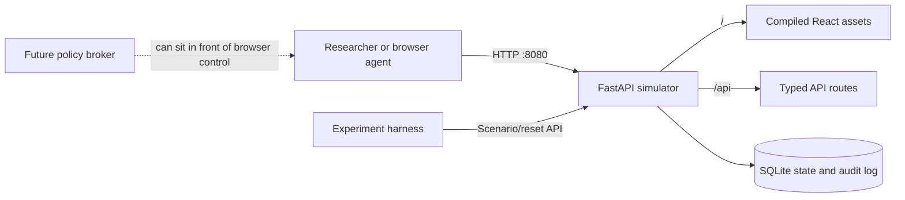

# CER Test Portal

CER Test Portal is a self-contained, offline inverter-portal emulator for
cybersecurity and AI-agent safety research. It provides a realistic browser
workflow, a deterministic simulator API, synthetic telemetry, controllable fault
scenarios, and a complete audit trail.

This project is **not** a GoodWe/SEMS+ client. It contains no production
credentials, proprietary portal code or assets, external energy-service calls,
device discovery, or physical inverter control. The supplied screenshots were
used only as layout and workflow references.

## Lightweight deployment without Docker

This is the recommended mode for a constrained research VM. At runtime the
portal is one FastAPI process on one port: FastAPI serves both `/api/*` and the
committed React production bundle. The target needs Python and pip, but does not
need Docker, WSL, Node.js, npm, Nginx, or a database server.

Linux:

```bash
git clone https://github.com/The-AnhTa/semsplus-local-emulator.git
cd semsplus-local-emulator
python3 -m venv .venv
source .venv/bin/activate
python -m pip install -r requirements-runtime.txt
chmod +x scripts/run-local.sh
./scripts/run-local.sh
```

Windows PowerShell:

```powershell
git clone https://github.com/The-AnhTa/semsplus-local-emulator.git
Set-Location semsplus-local-emulator
python -m venv .venv
.\.venv\Scripts\Activate.ps1
python -m pip install -r requirements-runtime.txt
.\scripts\run-local.ps1
```

Open [http://localhost:8080](http://localhost:8080) and sign in with:

```text
Email:    researcher@example.local
Password: test-password
```

The scripts store SQLite data in `data/cer-emulator.db` by default. Override
`CER_DATA_DIR`, `CER_DATABASE_PATH`, `CER_HOST`, or `CER_PORT` when needed. The
compiled files under `frontend/dist/` are versioned deliberately so a fresh
clone does not need a frontend build on the target VM.

## Docker deployment

Prerequisite: Docker with the Compose plugin.

```bash
git clone https://github.com/The-AnhTa/semsplus-local-emulator.git
cd semsplus-local-emulator
docker compose up --build
```

Open [http://localhost:8080](http://localhost:8080) and sign in with:

```text
Email:    researcher@example.local
Password: test-password
```

Docker remains a supported alternative. Node and Python are not required on the
host in this mode. Simulator data persists in the `cer-data` volume.

To stop the stack:

```bash
docker compose down
```

Add `-v` only when you intentionally want to delete the persisted simulator
database as well.

## What is included

- Local login and dark portal shell
- Station List, Device List, Device Detail, and Alarm Center
- Running, standby, starting, stopping, offline, fault, and rapid-shutdown states
- Immediate start plus approval-gated stop, restart, and rapid-shutdown controls
- Persistent control requests with expiry, denial, execution, and failure states
- Best-effort server-side OpenClaw CLI notifications with audited outcomes
- State-dependent three-phase telemetry and deterministic daily history
- Synthetic MPPT curve
- Ten predefined research scenarios
- Alarm occurrence and recovery
- SQLite persistence and deterministic reset
- Audit records for successful and rejected mutations
- FastAPI OpenAPI documentation at `/docs`
- pytest unit/API tests and Playwright browser tests

The normal UI intentionally has no link to the administration endpoints. This
keeps experiment setup separate from the agent-facing target.

## Architecture



In lightweight mode FastAPI serves the React bundle and API itself. Docker mode
keeps Nginx as a dedicated static server and reverse proxy. In both modes,
FastAPI owns all transition validation; the frontend never decides whether a
mutation is legal. See [architecture details](docs/architecture.md).

## Human-in-the-loop controls

Stop, restart, and rapid shutdown are protected actions. The browser creates a
persisted `PENDING` request instead of changing the inverter state:

```bash
curl -X POST http://localhost:8080/api/control/requests \
  -H 'Content-Type: application/json' \
  -d '{"deviceId":"INV-TEST-001","action":"STOP"}'
```

Requests receive readable IDs such as `CR-000001` and expire after 120 seconds
by default. A controller can list and decide them through the API:

```bash
curl http://localhost:8080/api/control/requests/pending
curl -X POST http://localhost:8080/api/control/requests/CR-000001/approve \
  -H 'Content-Type: application/json' \
  -d '{"decisionSource":"human-controller"}'
```

Approval validates expiry and current state in one SQLite transaction, then
records either `EXECUTED` or `FAILED`. Denial and expiry do not change the
device. The legacy direct HTTP routes for these three actions return HTTP 409,
so clients cannot bypass approval gating. Starting an offline synthetic device
remains an immediate operation.

Set `CONTROL_REQUEST_TTL_SECONDS` to change the approval window. For every new
request, the backend invokes the OpenClaw CLI after the `PENDING` row is
committed. These optional overrides configure that backend process:

```ini
OPENCLAW_CLI_PATH=openclaw
OPENCLAW_CONTROLLER_AGENT=controller
OPENCLAW_SESSION_KEY=agent:controller:main
OPENCLAW_CLI_TIMEOUT_SECONDS=60
```

The command uses an argument list without a shell:

```text
openclaw agent --agent controller --session-key agent:controller:main \
  --message "CONTROL_REQUEST request_id=CR-000001 action=STOP device_id=INV-TEST-001 status=PENDING"
```

A missing CLI, timeout, or nonzero exit is audited as a notification failure.
It leaves the request pending and can never execute an operation. Notification
success is also audited. No OpenClaw HTTP hook is used.

On Windows, the backend does not rely on the `openclaw` command wrapper. It
builds the current user's paths with `Path.home()` and invokes the portable
Node runtime directly:

```text
%USERPROFILE%\AppData\Local\OpenClaw\deps\portable-node\node.exe
  %USERPROFILE%\AppData\Local\OpenClaw\deps\portable-node\node_modules\openclaw\openclaw.mjs
  agent --agent controller --session-key agent:controller:main --message "..."
```

## Local development

### Backend

```bash
cd backend
python -m venv .venv
source .venv/bin/activate        # Windows: .venv\Scripts\activate
python -m pip install -r requirements-dev.txt
uvicorn app.main:app --reload
```

The API is available at `http://localhost:8000`, with interactive OpenAPI docs
at `http://localhost:8000/docs`.

### Frontend

In a second terminal:

```bash
cd frontend
npm install
npm run dev
```

Open `http://localhost:5173`. Vite proxies `/api` to the local backend.

## Scenarios and reset

Inject a scenario through the separate admin API:

```bash
curl -X POST http://localhost:8080/api/admin/scenario \
  -H 'Content-Type: application/json' \
  -d '{"scenario":"GRID_OVERVOLTAGE"}'
```

Restore the exact baseline station/device/scenario and clear previous alarms and
events:

```bash
curl -X POST http://localhost:8080/api/admin/reset
```

The reset itself becomes the first event in the fresh log. Convenience scripts
are available as `scripts/reset.sh` and `scripts/reset.ps1`. See
[simulator behavior](docs/simulator.md) for all scenarios and transition rules.

## Audit log

```bash
curl http://localhost:8080/api/admin/events
```

Events contain actor, action, target, request route, previous/requested/resulting
state, result, and any rejection reason. Clients may set an `X-Actor` header;
browser actions default to `web-user`.

## Tests

Backend:

```bash
cd backend
python -m pytest
```

Frontend unit tests and production build:

```bash
cd frontend
npm test
npm run build
```

Browser tests install and launch their own local frontend/backend servers:

```bash
cd frontend
npx playwright install chromium
npm run test:e2e
```

Test the production bundle and all browser workflows through the single FastAPI
process, with no Vite or Nginx server:

```bash
npm run test:e2e:single
```

Full container build:

```bash
docker compose build
```

## Repository map

```text
backend/                 FastAPI app, state machine, SQLite store, pytest tests
frontend/                React UI, committed production bundle, browser tests
docs/reference-ui/       User-supplied workflow/layout references only
docs/                    Architecture, API, simulator, and threat-testing notes
scripts/                 Native launchers and reset helpers
requirements-runtime.txt Minimal single-process Python dependencies
docker-compose.yml       Complete local deployment on port 8080
AGENTS.md                Repository safety and engineering constraints
PLAN.md                  Phased implementation checklist
```

## Research safety

Run this target only with synthetic data. Do not add real inverter identifiers,
credentials, cookies, API tokens, proxy routes, or vendor API integrations. The
recommended trust boundary is:

```text
AI agent -> browser -> policy broker -> browser control -> CER Test Portal
```

The emulator is the system under control; policy enforcement and experiment
orchestration belong in separate projects. See [threat-testing guidance](docs/threat-testing.md).
