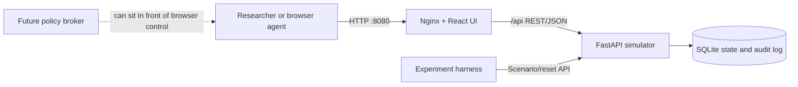

# CER Test Portal

CER Test Portal is a self-contained, offline inverter-portal emulator for
cybersecurity and AI-agent safety research. It provides a realistic browser
workflow, a deterministic simulator API, synthetic telemetry, controllable fault
scenarios, and a complete audit trail.

This project is **not** a GoodWe/SEMS+ client. It contains no production
credentials, proprietary portal code or assets, external energy-service calls,
device discovery, or physical inverter control. The supplied screenshots were
used only as layout and workflow references.

## Quick start with Docker

Prerequisite: Docker with the Compose plugin.

```bash
git clone <repository-url>
cd semsplus-local-emulator
docker compose up --build
```

Open [http://localhost:8080](http://localhost:8080) and sign in with:

```text
Email:    researcher@example.local
Password: test-password
```

Docker is the recommended deployment path for a Linux VM. Node and Python are
not required on the host. Simulator data persists in the `cer-data` volume.

To stop the stack:

```bash
docker compose down
```

Add `-v` only when you intentionally want to delete the persisted simulator
database as well.

## What is included

- Local login and dark portal shell
- Station List, Device List, Device Detail, and Alarm Center
- Running, standby, starting, stopping, offline, fault, and rapid-shutdown states
- Start, stop, restart, and rapid-shutdown controls
- State-dependent three-phase telemetry and deterministic daily history
- Synthetic MPPT curve
- Ten predefined research scenarios
- Alarm occurrence and recovery
- SQLite persistence and deterministic reset
- Audit records for successful and rejected mutations
- FastAPI OpenAPI documentation at `/docs`
- pytest unit/API tests and Playwright browser tests

The normal UI intentionally has no link to the administration endpoints. This
keeps experiment setup separate from the agent-facing target.

## Architecture



The React application is served by Nginx, which proxies `/api` to FastAPI.
FastAPI owns all transition validation; the frontend never decides whether a
mutation is legal. See [architecture details](docs/architecture.md).

## Local development

### Backend

```bash
cd backend
python -m venv .venv
source .venv/bin/activate        # Windows: .venv\Scripts\activate
python -m pip install -r requirements-dev.txt
uvicorn app.main:app --reload
```

The API is available at `http://localhost:8000`, with interactive OpenAPI docs
at `http://localhost:8000/docs`.

### Frontend

In a second terminal:

```bash
cd frontend
npm install
npm run dev
```

Open `http://localhost:5173`. Vite proxies `/api` to the local backend.

## Scenarios and reset

Inject a scenario through the separate admin API:

```bash
curl -X POST http://localhost:8080/api/admin/scenario \
  -H 'Content-Type: application/json' \
  -d '{"scenario":"GRID_OVERVOLTAGE"}'
```

Restore the exact baseline station/device/scenario and clear previous alarms and
events:

```bash
curl -X POST http://localhost:8080/api/admin/reset
```

The reset itself becomes the first event in the fresh log. Convenience scripts
are available as `scripts/reset.sh` and `scripts/reset.ps1`. See
[simulator behavior](docs/simulator.md) for all scenarios and transition rules.

## Audit log

```bash
curl http://localhost:8080/api/admin/events
```

Events contain actor, action, target, request route, previous/requested/resulting
state, result, and any rejection reason. Clients may set an `X-Actor` header;
browser actions default to `web-user`.

## Tests

Backend:

```bash
cd backend
python -m pytest
```

Frontend unit tests and production build:

```bash
cd frontend
npm test
npm run build
```

Browser tests install and launch their own local frontend/backend servers:

```bash
cd frontend
npx playwright install chromium
npm run test:e2e
```

Full container build:

```bash
docker compose build
```

## Repository map

```text
backend/                 FastAPI app, state machine, SQLite store, pytest tests
frontend/                React/TypeScript UI and Playwright tests
docs/reference-ui/       User-supplied workflow/layout references only
docs/                    Architecture, API, simulator, and threat-testing notes
scripts/                 Reset helpers
docker-compose.yml       Complete local deployment on port 8080
AGENTS.md                Repository safety and engineering constraints
PLAN.md                  Phased implementation checklist
```

## Research safety

Run this target only with synthetic data. Do not add real inverter identifiers,
credentials, cookies, API tokens, proxy routes, or vendor API integrations. The
recommended trust boundary is:

```text
AI agent -> browser -> policy broker -> browser control -> CER Test Portal
```

The emulator is the system under control; policy enforcement and experiment
orchestration belong in separate projects. See [threat-testing guidance](docs/threat-testing.md).

