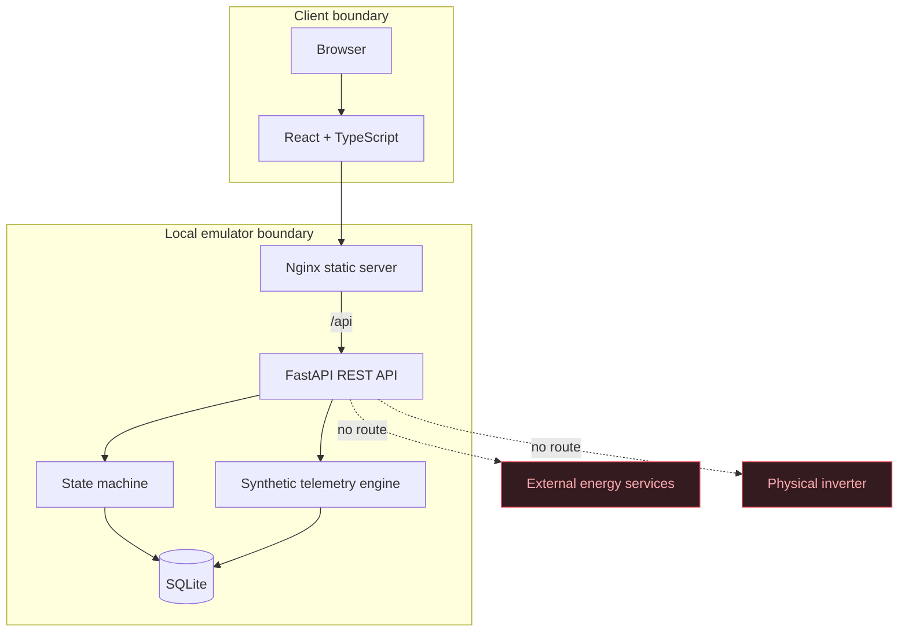

# Architecture

## Components

The production Compose deployment exposes only Nginx on host port 8080. The
backend is addressable inside the Compose network but is not published on a host
port. Nginx serves the built single-page app and proxies `/api` requests.

## Backend boundaries

- `models.py` owns typed API contracts and enums.
- `state_machine.py` owns legal command plans and transitional states.
- `store.py` owns SQLite persistence, seeding, reset, alarms, scenarios,
  telemetry calculation, and audit writes.
- `main.py` maps HTTP endpoints to store behavior and explicit HTTP errors.

SQLite access is serialized for state-changing operations. Transitions are
validated on the server and return HTTP 409 when illegal. A rejected operation
is audited before the error is returned.

## Frontend boundaries

The frontend is a browser client only. It displays server-owned state and calls
documented REST routes. Important actions have semantic labels and stable
`data-testid` values. It contains no admin-scenario navigation and no device or
vendor integration code.

## Persistence

The initial data set is one station and one device. Docker stores the SQLite file
in the `cer-data` named volume. `POST /api/admin/reset` clears mutable records and
reseeds the same identifiers and baseline values.

