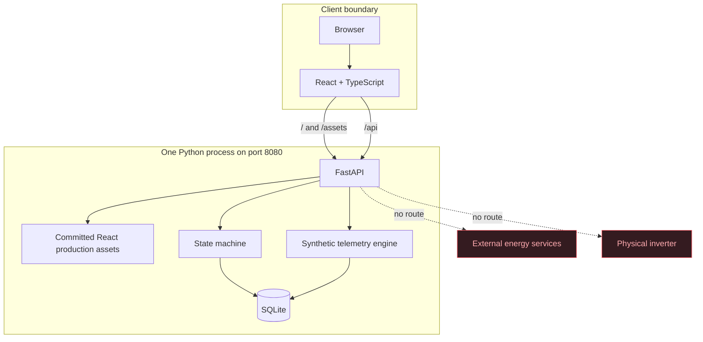

# Architecture

## Lightweight single-process deployment

This is the preferred constrained-VM layout. `scripts/run-local.sh` and
`scripts/run-local.ps1` start Uvicorn with the backend module path configured.
FastAPI serves the versioned `frontend/dist` bundle, including fallback routing
for browser-side URLs, and owns `/api` routes on the same origin. SQLite remains
a local file. No frontend toolchain or reverse proxy is needed at runtime.

## Docker deployment

The existing Compose deployment remains available. It exposes Nginx on host
port 8080; the backend is reachable only inside the Compose network. Nginx
serves the same frontend build and proxies `/api` requests to FastAPI.

## Backend boundaries

- `models.py` owns typed API contracts and enums.
- `state_machine.py` owns legal command plans and transitional states.
- `store.py` owns SQLite persistence, seeding, reset, alarms, scenarios,
  telemetry calculation, and audit writes.
- `main.py` maps HTTP endpoints to store behavior and explicit HTTP errors.

SQLite access is serialized for state-changing operations. Transitions are
validated on the server and return HTTP 409 when illegal. A rejected operation
is audited before the error is returned.

## Frontend boundaries

The frontend is a browser client only. It displays server-owned state and calls
documented REST routes. Important actions have semantic labels and stable
`data-testid` values. It contains no admin-scenario navigation and no device or
vendor integration code.

## Persistence

The initial data set is one station and one device. Native launchers store the
database in `data/cer-emulator.db`; Docker uses the `cer-data` named volume.
`POST /api/admin/reset` clears mutable records and reseeds the same identifiers
and baseline values.
