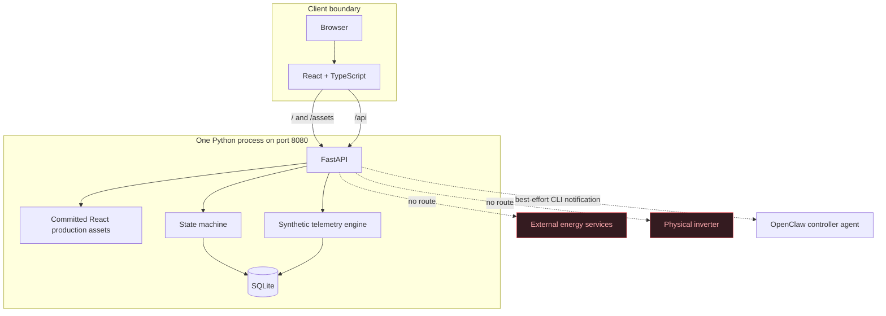

# Architecture

## Lightweight single-process deployment



This is the preferred constrained-VM layout. `scripts/run-local.sh` and
`scripts/run-local.ps1` start Uvicorn with the backend module path configured.
FastAPI serves the versioned `frontend/dist` bundle, including fallback routing
for browser-side URLs, and owns `/api` routes on the same origin. SQLite remains
a local file. No frontend toolchain or reverse proxy is needed at runtime.

## Docker deployment

The existing Compose deployment remains available. It exposes Nginx on host
port 8080; the backend is reachable only inside the Compose network. Nginx
serves the same frontend build and proxies `/api` requests to FastAPI.

## Backend boundaries

- `models.py` owns typed API contracts and enums.
- `notifier.py` owns the best-effort server-side OpenClaw CLI invocation.
- `state_machine.py` owns legal command plans and transitional states.
- `store.py` owns SQLite persistence, seeding, reset, alarms, scenarios,
  telemetry calculation, and audit writes.
- `main.py` maps HTTP endpoints to store behavior and explicit HTTP errors.

SQLite access is serialized for state-changing operations. Transitions are
validated on the server and return HTTP 409 when illegal. A rejected operation
is audited before the error is returned.

## Human-in-the-loop control boundary

```mermaid
sequenceDiagram
    participant B as Browser
    participant A as FastAPI
    participant D as SQLite
    participant O as OpenClaw CLI
    participant C as Controller

    B->>A: POST /api/control/requests
    A->>D: Insert PENDING + CREATED audit
    A->>D: COMMIT
    A-->>O: openclaw agent --agent controller ...
    A->>D: Audit notification success or failure
    A-->>B: 202 CR-000001 PENDING
    Note over D: Device state is unchanged
    C->>A: POST /api/control/requests/CR-000001/approve
    A->>D: BEGIN IMMEDIATE; verify PENDING and unexpired
    A->>D: APPROVED audit; execute internal transition
    A->>D: Store EXECUTED (or FAILED) + audit; COMMIT
    A-->>C: Final persisted request
```

`control_requests` and their lifecycle audits are durable SQLite records.
Approval, execution, and final status are written in a single transaction. A
savepoint restores the device state if execution fails. Denial and expiry only
update the request and audit log. Expiration is evaluated whenever requests are
listed, fetched, approved, or denied.

Only `start` has a directly executable HTTP route. The stop, restart, and rapid
shutdown routes explicitly reject with HTTP 409. Their actual transition
function is internal to the store and is reached only by the approved-request
path. The browser polls the persisted request and reports success only after it
observes `EXECUTED`.

OpenClaw integration is best-effort and one-way. After committing the request,
FastAPI runs `openclaw agent` with an argument list, `shell=False`, captured
output, and a short timeout. It targets the `controller` agent and
`agent:controller:main` session by default. CLI success and failure are both
audited. A missing executable, timeout, or nonzero exit leaves the request
`PENDING`; notification is never treated as approval and never receives
authority to call a physical device or external energy service. No OpenClaw
HTTP hook endpoint is used.

## Frontend boundaries

The frontend is a browser client only. It displays server-owned state and calls
documented REST routes. Important actions have semantic labels and stable
`data-testid` values. It contains no admin-scenario navigation and no device or
vendor integration code.

## Persistence

The initial data set is one station and one device. Native launchers store the
database in `data/cer-emulator.db`; Docker uses the `cer-data` named volume.
`POST /api/admin/reset` clears mutable records and reseeds the same identifiers
and baseline values, including resetting the readable control-request sequence.
