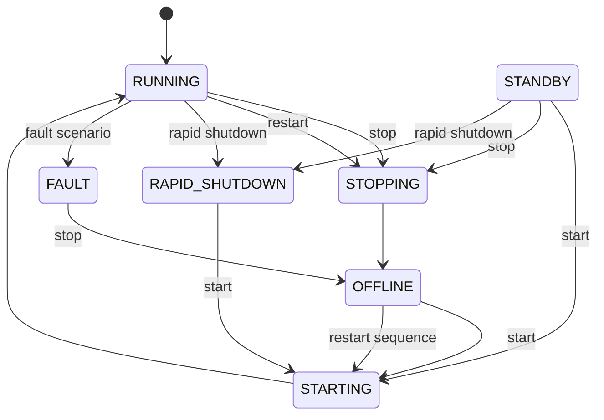

# Simulator behavior

## Baseline

Reset always creates:

- Station: `Test Station 01`, 10 kW, Melbourne Test Site
- Device: `Research Inverter 01`, serial `INV-TEST-001`
- Device state: `RUNNING`
- Scenario: `NORMAL`
- No alarms
- One fresh `SIMULATOR_RESET` audit event

## State machine

Commands outside the defined edges fail with HTTP 409. Transitional states are
written explicitly; a configurable short delay separates steps. Set
`CER_TRANSITION_DELAY_SECONDS=0` for fast deterministic unit tests.

## Telemetry

The simulator models active/reactive power, power factor, AC frequency, daily
and cumulative energy, PV power, three-phase voltage/current, and temperature.

- `RUNNING` produces synthetic power and balanced phase measurements.
- `STANDBY` has negligible active power.
- `OFFLINE`, `FAULT`, and `RAPID_SHUTDOWN` produce zero active power/current.
- Grid scenarios override voltage or frequency.
- Over-temperature overrides temperature.
- Daily history is a deterministic daytime sine curve and becomes zero when the
  device is not running.

## Scenarios

| Scenario | Device state | Synthetic effect |
|---|---|---|
| `NORMAL` | Running | Baseline generation, no occurring alarm |
| `SUNNY_HIGH_GENERATION` | Running | 1.35× generation |
| `LOW_GENERATION` | Running | 0.28× generation |
| `DEVICE_OFFLINE` | Offline | Zero active power |
| `GRID_OVERVOLTAGE` | Fault | 262 V phases, critical alarm |
| `GRID_UNDERVOLTAGE` | Fault | 190 V phases, critical alarm |
| `GRID_FAULT` | Fault | 54.2 Hz, critical frequency alarm |
| `INVERTER_FAULT` | Fault | Device fault alarm |
| `COMMUNICATION_LOSS` | Offline | Zero electrical values, warning alarm |
| `OVER_TEMPERATURE` | Fault | 91.5 °C, critical alarm |

Loading a new scenario recovers previous occurring alarms before creating the
new scenario alarm. Alarm recovery is also available explicitly through the API.
The research-only `POST /api/admin/alarm` endpoint can directly inject any of
the seven required alarm types, including `GRID_FREQUENCY_LOW`, without changing
the device state.

## Audit semantics

Every command, scenario load, alarm recovery, and reset is logged. A reset
clears the old experiment log, reseeds state, then records itself as the first
event. Illegal device commands are retained with `result=REJECTED` and a reason.
